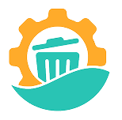

# Bengkel Sampah App

<div align="center">
  
  <h3>🌱 Aplikasi Pengelolaan Sampah Pintar</h3>
  <p>Membantu masyarakat dalam mendaur ulang dan mengelola sampah dengan lebih baik</p>
</div>

## 📱 Tentang Aplikasi

Bengkel Sampah adalah aplikasi mobile yang dirancang untuk memudahkan masyarakat dalam mengelola sampah secara bertanggung jawab. Aplikasi ini menyediakan berbagai fitur untuk edukasi, pengumpulan, dan pengelolaan sampah yang terintegrasi dengan sistem bank sampah.

### 🎯 Fitur Utama

- **🏠 Beranda (Home)** - Dashboard utama dengan ringkasan aktivitas dan statistik
- **📚 Katalog Sampah** - Database lengkap jenis-jenis sampah dengan informasi detail
- **♻️ Pilahku** - Manajemen sampah pribadi dan tracking pengumpulan
- **🏦 Bank Sampah** - Integrasi dengan bank sampah terdekat
- **📰 Artikel Edukasi** - Konten edukatif tentang pengelolaan sampah
- **🎉 Event & Promosi** - Event lingkungan dan program khusus
- **⭐ Sistem Poin** - Reward system untuk aktivitas ramah lingkungan
- **🔔 Notifikasi** - Update real-time tentang status setoran dan event
- **👤 Profil Pengguna** - Manajemen akun dan preferensi

## 🛠️ Teknologi yang Digunakan

### Frontend
- **Flutter** - Framework cross-platform mobile development
- **Dart** - Bahasa pemrograman utama
- **Provider** - State management
- **Material Design 3** - UI/UX framework

### Backend Integration
- **REST API** - Integrasi dengan backend Laravel
- **Firebase** - Push notifications dan analytics
- **HTTP Client** - Network communication

### Dependencies Utama
```yaml
dependencies:
  flutter: sdk: flutter
  http: ^1.1.0
  provider: ^6.1.1
  flutter_secure_storage: ^9.0.0
  firebase_core: ^3.6.0
  firebase_messaging: ^15.1.3
  image_picker: ^1.0.4
  google_fonts: ^6.1.0
  intl: ^0.18.1
```

## 📁 Struktur Project

```
lib/
├── constants/           # Konstanta aplikasi
│   ├── api_constants.dart
│   └── app_colors.dart
├── models/             # Data models
│   ├── user_model.dart
│   ├── sampah_model.dart
│   ├── setoran_model.dart
│   └── ...
├── providers/          # State management
│   ├── auth_provider.dart
│   ├── home_provider.dart
│   ├── katalog_provider.dart
│   └── ...
├── screens/           # UI screens
│   ├── home_screen.dart
│   ├── katalog_screen.dart
│   ├── pilahku_screen.dart
│   └── ...
├── services/          # Business logic
│   ├── api_service.dart
│   ├── firebase_messaging_service.dart
│   └── version_service.dart
├── widgets/           # Reusable components
│   ├── custom_buttons.dart
│   ├── custom_text_field.dart
│   └── ...
└── main.dart         # Entry point
```

## 🚀 Cara Menjalankan Project

### Prerequisites
- Flutter SDK (>=3.2.3)
- Dart SDK
- Android Studio / VS Code
- Android SDK / Xcode (untuk iOS)

### Installation

1. **Clone repository**
   ```bash
   git clone https://github.com/your-username/bengkelsampah_app.git
   cd bengkelsampah_app
   ```

2. **Install dependencies**
   ```bash
   flutter pub get
   ```

3. **Setup Firebase** (opsional)
   - Tambahkan file `google-services.json` untuk Android
   - Tambahkan file `GoogleService-Info.plist` untuk iOS

4. **Run aplikasi**
   ```bash
   flutter run
   ```

### Build untuk Production

**Android APK:**
```bash
flutter build apk --release
```

**Android App Bundle:**
```bash
flutter build appbundle --release
```

**iOS:**
```bash
flutter build ios --release
```

## 🔧 Konfigurasi

### API Configuration
Edit file `lib/constants/api_constants.dart` untuk mengatur endpoint API:
```dart
class ApiConstants {
  static const String baseUrl = 'https://bengkelsampah.com/api';
  // ... endpoint lainnya
}
```

### Firebase Setup
1. Buat project di [Firebase Console](https://console.firebase.google.com/)
2. Download konfigurasi untuk Android dan iOS
3. Place file konfigurasi di folder yang sesuai

## 📱 Fitur Detail

### 1. Sistem Autentikasi
- Login dengan email/phone
- Registrasi user baru
- Verifikasi OTP
- Reset password
- Secure token storage

### 2. Katalog Sampah
- Database lengkap jenis sampah
- Informasi harga per kategori
- Panduan pemilahan
- Gambar referensi

### 3. Pilahku (Personal Waste Management)
- Tracking sampah pribadi
- Estimasi nilai sampah
- Riwayat pengumpulan
- Target pengumpulan

### 4. Bank Sampah Integration
- Daftar bank sampah terdekat
- Informasi kontak dan alamat
- Sistem booking penjemputan
- Tracking status setoran

### 5. Sistem Poin & Reward
- Poin untuk setiap aktivitas
- Riwayat transaksi poin
- Redeem reward
- Leaderboard komunitas

### 6. Notifikasi
- Push notification real-time
- Update status setoran
- Reminder event
- Promo dan informasi

## 🎨 UI/UX Features

- **Responsive Design** - Mendukung berbagai ukuran layar
- **Dark/Light Mode** - Tema yang dapat disesuaikan
- **Custom Fonts** - Manrope dan Poppins
- **Smooth Animations** - Transisi yang halus
- **Accessibility** - Mendukung aksesibilitas

## 🔒 Security Features

- **Secure Storage** - Penyimpanan token yang aman
- **Input Validation** - Validasi input user
- **API Security** - HTTPS dan token authentication
- **Data Encryption** - Enkripsi data sensitif

## 📊 Performance

- **Lazy Loading** - Loading data secara bertahap
- **Image Optimization** - Kompresi gambar otomatis
- **Caching** - Cache data untuk performa lebih baik
- **Memory Management** - Pengelolaan memori yang efisien

## 🧪 Testing

```bash
# Unit tests
flutter test

# Widget tests
flutter test test/widget_test.dart

# Integration tests
flutter drive --target=test_driver/app.dart
```

## 📈 Monitoring & Analytics

- **Firebase Analytics** - Tracking user behavior
- **Crashlytics** - Error reporting
- **Performance Monitoring** - App performance tracking

## 🤝 Contributing

1. Fork repository
2. Buat feature branch (`git checkout -b feature/AmazingFeature`)
3. Commit changes (`git commit -m 'Add some AmazingFeature'`)
4. Push ke branch (`git push origin feature/AmazingFeature`)
5. Buat Pull Request

## 📄 License

Project ini dilisensikan di bawah [MIT License](LICENSE).

## 👥 Team

- **Developer** - [Nama Developer]
- **UI/UX Designer** - [Nama Designer]
- **Product Manager** - [Nama PM]

## 📞 Support

- **Email**: support@bengkelsampah.com
- **Website**: https://bengkelsampah.com
- **Documentation**: [Link Documentation]

## 🔄 Changelog

### Version 1.0.0+5
- Initial release
- Core features implementation
- Firebase integration
- Bank sampah integration

---

<div align="center">
  <p>Made with ❤️ for a better environment</p>
  <p>🌱 Reduce • Reuse • Recycle 🌱</p>
</div>
